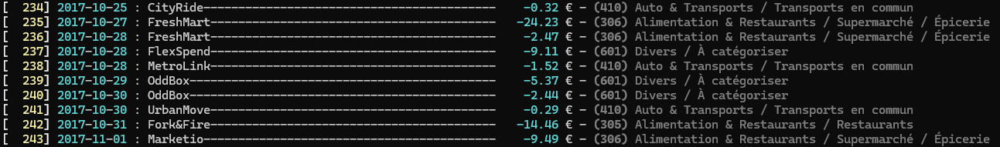
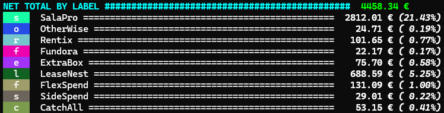
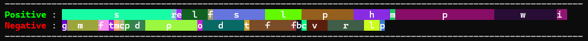
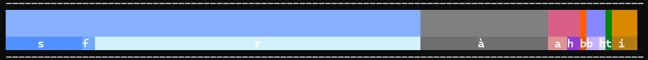
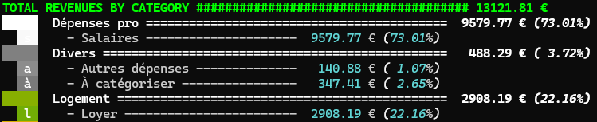
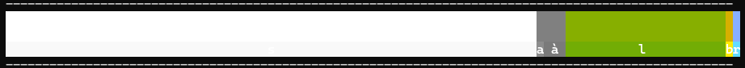
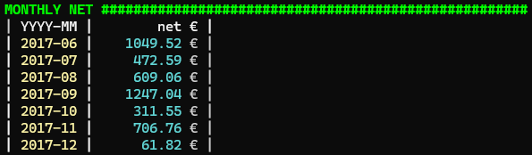
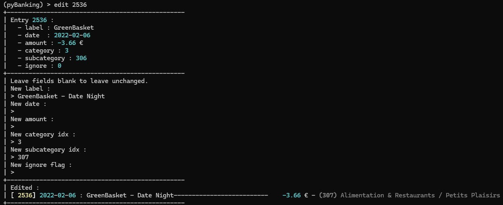

# pyBanking

_Let's pretend this is all under control._

## Commands

```
> help
Documented commands (type help <topic>):
========================================
edit  exit  help  list  search  show  sql
```

### `list` command
```
> help list
Prints list of elements
| Supported commands :
| - list categories
```

### `show` command
```
> help show
Shows list of expenses
| Supported commands :
| - show all
| - show uncategorized
| - show date after <dd-mm-yyyy>
|   > ex. : show date after 01-01-2024
| - show date before <dd-mm-yyyy>
|   > ex. : show date before 01-01-2024
| - show date between <dd-mm-yyyy:dd-mm-yyyy>
|   > ex. : show date afte between 01-01-2024:31-12-2025
| - show month <mm-yyyy>
| - show year <yyyy>
| - show where <sql filter>
|   > ex. : show where amount < -1000
|   > columns in db are :
|     - date (str)
|     - label (str)
|     - amount (float)
|     - category (int)
|     - subcategory (int)
|     - ignore (int)
```

#### `show date between 01-01-2017:31-12-2017` - sample of transaction list (mock data)


#### `show date between 01-01-2017:31-12-2017` - sample of expenses categorized by label (mock data)



#### `show date between 01-01-2017:31-12-2017` - sample of expenses categorized by category/subcategory (mock data)



#### `show date between 01-01-2017:31-12-2017` - sample of revenues categorized by category/subcategory (mock data)



#### `show date between 01-01-2017:31-12-2017` - monthly net (mock data)


### `search` command
```
> help search
Searches transaction entries labels for a string
| Syntax : search <pattern to search>
| > ex. : search sushi bar
```

### `edit` command
```
> help edit
Edits a database entry
| Syntax : edit <db entry id>
| > ex. : edit 1801
```

#### `edit 2536` - (mock data)


### `sql` command
```
> help sql
Executes a SQL request on the database
```

### `exit` command
```
> help exit
Exits the program
```